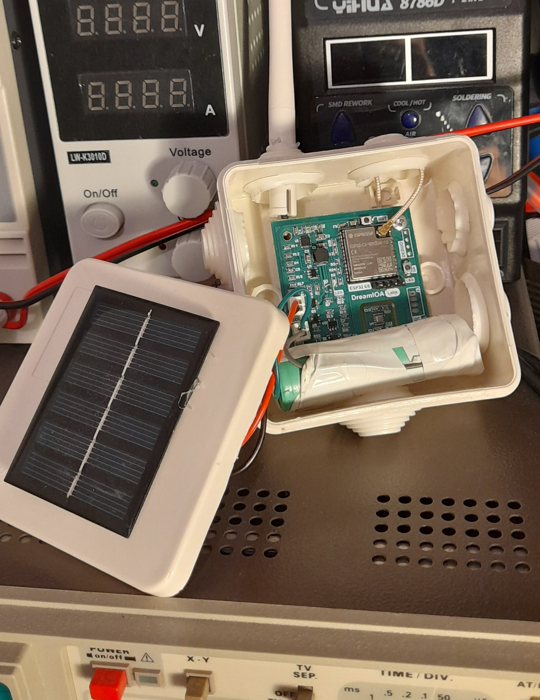
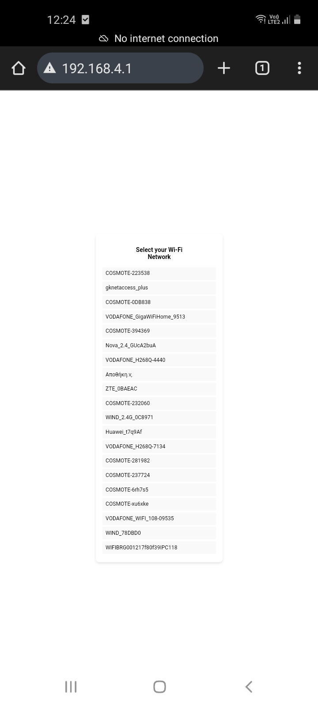
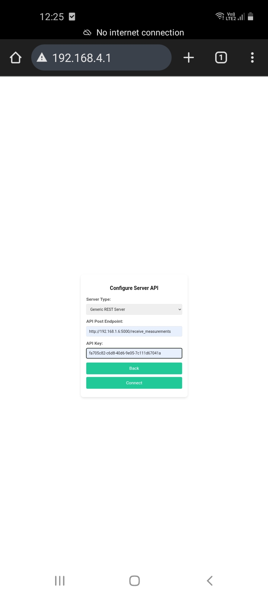
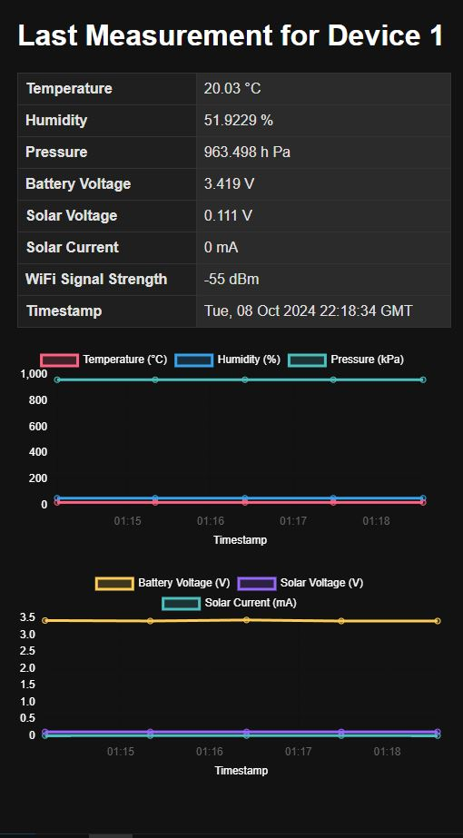
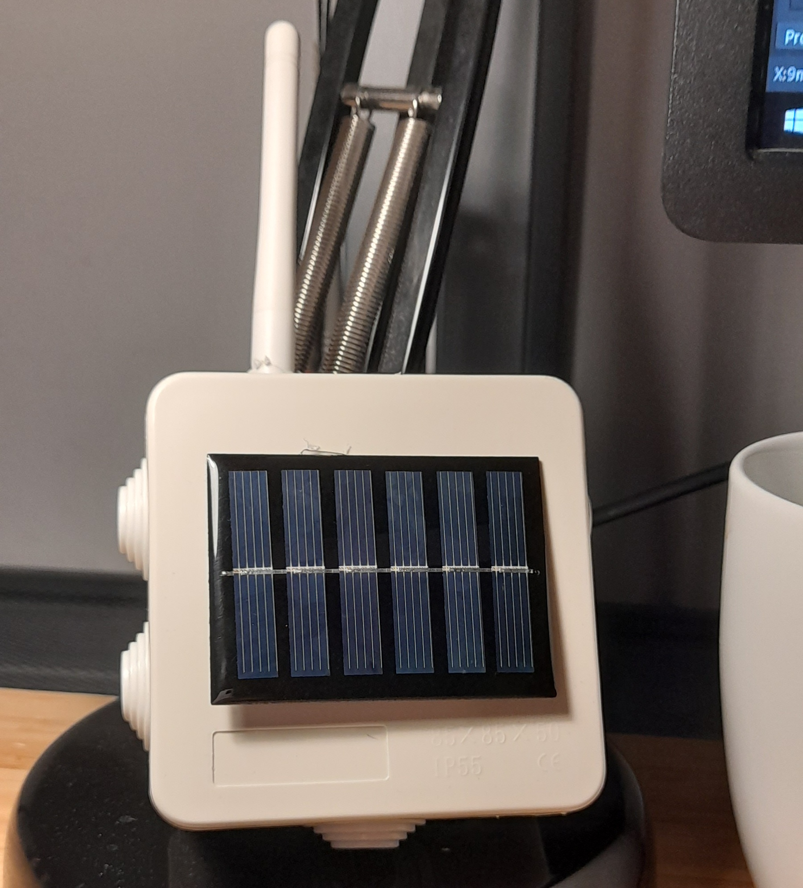
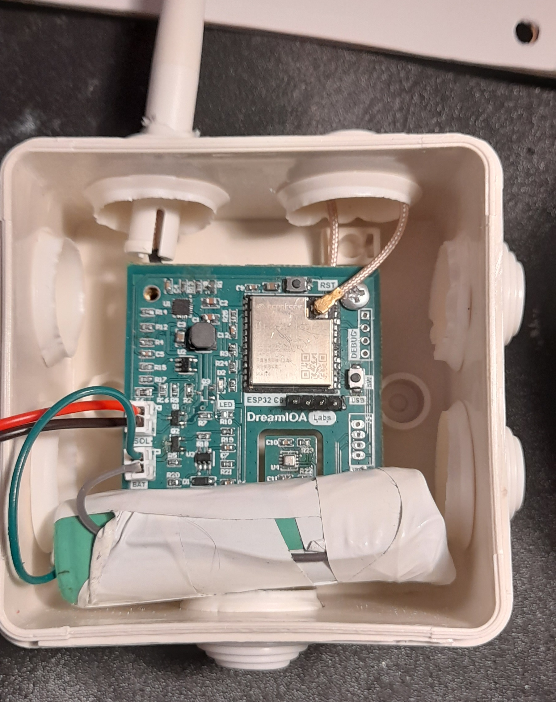

# DreamIOALabs S-NODE-1

## Introduction

This repository contains the firmware for the DreamIOALabs S-NODE-1, a sensor node designed to perform sensor measurements (humidity, temperature, pressure and hardware status) and send the data to a server via WIFI connection. The node can operate in two modes: 
1. **Normal Mode** (wake-up, collect data, post data and deep sleep).
2. **Configuration Mode** (reset button press following 3 presses of the setup button to reset node configuration and enter into config mode).

Once the task cycle is complete, the node enters deep sleep until the next measurement cycle specified in the measurement post response. Deep sleep is used to achieve minimal power 
consumption and maximize battery life in envirromental/no power conditions.



## Important Points

### Node Initial Setup

The node has a config mode in which the ESP32 works as an access point and hosts a web server in the default IP 192.168.4.1. The user has to connect to the node's wifi in order to pass the home network SSID and the password of the local network in order for the node to have internet access. 



Server information has to be also added through the web server UI, where the user has to specify the endpoint of the server where measuremnts are going to be posted and the API token (UUID preferably) which is generated by the server when a device is added and to associate measurements with device and other backend details.



In case WIFI credentials are wrong, node will fail to connect to the local access point and switch back to AP mode so the user can reconfigure.

A timer is also setup to monitor the time the web server is up so if no user prompt happens, the server will timeout and the node will get in deep sleep for DEFAULT_SLEEP_DURATION = 15 to prevent battery drainage.

### Defined Sensor API

This section outlines the structure of the JSON data sent from the device to the server and the expected response format from the server. The device sends a JSON payload containing sensor data and device information to the server. 

Below is the structure of the JSON sent by the sensor to the server:

```json
{
    "device_key": <String: Device API Key>,
    "temp": <Float: Temperature C>,
    "humid": <Float: % Humidity>,
    "pressure": <Float: Pressure>,
    "battery_voltage": <Float: Battery Voltage V>,
    "solar_voltage": <Float: Solar Voltage V>,
    "solar_current": <Float: Solar Charging Current mA>,
    "wifi_signal_strength": <Float: Signal Stregth dBm>
}
```

After successfull receive of the measurements JSON, the node expects the server to respond with a json containing the sleep duration. In this way the node's sleep duration can be updated and saved into node configuration without additional endpoints on the server side and GET requests from from the node in advance. The only downside is that the sensor deep sleep duration can be updated only on the measurement POST response which is not big deal.

Below is the structure of the JSON sent by the server to the node:

```json
{
    "sleep_duration": <Int: Minutes>
}
```

### LED Error Indicator

The `error_blinker` function blinks the LED a specific number of times to indicate different statuses or errors. Below is the list of possible error codes and their corresponding blink patterns:

| Error Code | Error Name                  | Number of Blinks | Description                                      |
|------------|-----------------------------|------------------|--------------------------------------------------|
| 1          | `CYCLE_OK`                  | 1                | Indicates the measurement cycle completed successfully.  |
| 3          | `ENTERED_CONFIG_MODE`       | 3                | Node has entered configuration mode.             |
| 4          | `WIFI_CRED_ERR`             | 4                | There was an error with the Wi-Fi credentials. Node will switch back to config mode automatically.    |
| 5          | `HTTP_POST_ERR`             | 5                | There was an error posting data to the server.    |
| 6          | `WIFI_CRED_IN_CONFIG_ERR`   | 6                | Wi-Fi credentials error occurred in config mode.  |
| 10         | `AP_TIMEOUT`                | 10               | Timeout occurred while trying to connect to AP.   |

## Firmware implementation
The projects firmware was implemented using the ESP-IDF framework APIs provided by Espressif. This was my first project and experience with the framework looking at more than 50-hours of firmware coding and debuging using the ESP_LOGGER funtionality with OpenOCD. 

At the start of the firmware development, I used a ESP32-C3 dev board with the PlattformIO/Arduino framework but in the final design I used the new ESP32-C6 SOM which was not supported by arduino and I had to do the development from the beginning. Anyway, I found it as a way to get into the more advance and with less overhead ESP-IDF and gain some experience with it. It was worth-it.

## Power Consumption and Energy Harvesting
In this section we are going to cover some important notes of the power harversted by the system and the power consumption during operation. We are going to cover the worst-case power consumption which is working on 1-minute interval.

- Power consumption on deep sleep is in the order of uA which is considered minimal(still importand tho) comparing it with the system consumption during operation.
- Power consumption during operation seen using the bench power supply: 
    - Cycle on duration AVG: 10 Seconds
    - Operating Voltage AVG: 3.3V
    - Operating Current AVG: 60mA
- On Power: P = 3.3V × 0.06A = 0.198W
- On time per day: 1440cycles × 10s/cycle = 14400s

- Calculate energy consumed: E = 0.198W × 14400s = 2851J
- Energy (Wh) =  2851J / 3600s = 0.791 (Wh)

From the measurements saved in the table in MySQL we can see that in a good day we are charging for at least 4hours on 2.8V and 80mA.
- Calculate energy harvested: E = 0.224W × 4h × 60min × 60s = 3.225J
- Energy (Wh) =  2851J / 3600s = 0.896 (Wh)

As you can see from the calculations above on these 4 hours we harvest a bit more energy than we consume the hole day with 1-minute interval. Still I have not taken into account moments where we still harvest energy but not with peak power, but still there can be a case which is not very sunny and we don't get that kind of peak power so we are quite even.

Now for how long the node will be alive when no sunny days and no power is harvested really depends on what size battery you are using but still interval can be configured cause 1-minute interval is overkill for a simple environmental measurement.

Note 1: for these calculations I use the Revision 2 hardware where a Li-on battery is used and it can be fully charged 

Note 2: if i have made a serious mistake in the calculations and i am way off please let me know.

## Test Server and Measurements

### Test Server
I have included a simple test server, generated by ChatGPT(with some tweaks by me, because I didn't have time and I didn't want to mess around with Software and HTML non-sense), implemented using Python Flask, a MySQL schema with some basic Endpoints like post_measurements used by the node, get latest measurement and a get template HTML.



I used the server to check if the firmware was reliable (if i had any measuremnt losses or ESP crashes) and also because I wanted to monitor the charging circuitry if it was done right. Anyway, ChatGPT saved me some time to cover other more important aspects of the project. 

As you see below charging works like a treat saving around 200mW during sun hours and no 1-minute measurements POST is missed. But we have a big issue I have to address. Can you see it in the table?


Clearly temperature in sun hours increases the node's sensor temperature which is WAY OFF. This is a big design miscalculation I haven't thought of, and i don't know of any solution other than a proper casing. Still I don't think this will solve the issue but i have some tiny hope.



## Hardware Design

### Revision 1 - Not recommended
- **Microcontroller SOM:** ESP32-C6-WROOM-1
- **Sensor:** Bosch BME-280
- **Power Harverster:** STMicroelectronics SPV1050
- **Solar Panel:** 3.5V 0.25W (AliExpress)
- **Battery:** 3.2V LifePO4 2500mAh Cell

In this revision I thought using a 3.2V LifePO4 cell to power up the MCU and the sensor directry. I also setup the power harverster to work as a charger of the battery using the solar panel and for nothing else. Since all the circuitry is powered directly of the battery i had to implement Under voltage protection circuitry using mosfet and an low power OpAmp with a reference voltage for power gating.

Using a LifePO4 cell and feeding voltage directry was a mistake because these kinds of cells are quite expensive and not very common.

A Li-on battery could not be used (at the end i used a lion cell charged at max 3.5V) because nominal voltage is way higher that the max voltage of the sensor and the SOM. The kind of empty Lion cell approach has also other issues like that the hole capacity of the battery cannot be used.

To solve the issue of the battery voltage, I am planning to use a low power TI switching regulator with UVP in the next revision to let the Lion cell to charge all the way and still get 3-3.3V on the SOM and the sensor while keeping the harvester logic the same.



### Revision 2 - TODO
- Add a low power Switching regulator
- Increase mounting hole size and clearence with surrounding components
- Get rid of the UVP circuitry since the switcher has it
- Maybe move the sensor on the back side of the PCB so I have better thermal insulation

## Firmware Improvements and Funtionality Additions
- Add smart functionality to intelligently control sleep duration taking into account energy harvested and battery voltage so we can optimize POSTing interval based on energy conditions
- Add support for existing IoT Framework Logic
- Transition from HTTP to HTTPS for security
- Integrate Zigbee Connectivity since this new version of the ESP32-C6 supports it and more power efficiency can be achieved
- Add support for Firebase Posts which is a free cloud service
- Mobile Phone Application/Complete Web Application supporting common IoT services like users/multiple device management/data visualization and filtering(that's for someone else who loves these stuff and wants to contribute :-).  
- Add a Notification field on the POST measurements JSON to get debugging messages from the node if anything bad happens

## Third-Party Libraries

### BMX280 Driver

- **License:** MIT License
- **Copyright:** (C) 2020 Halit Utku Maden
- **Contact:** [utkumaden@hotmail.com](mailto:utkumaden@hotmail.com)

- **Repository Link:** https://github.com/utkumaden/esp-idf-bmx280

## Threads that helped me to solve some firmware issues
- Switching from ap to sta and viceversa crashes solved using the thread: https://esp32.com/viewtopic.php?t=22486
- Also had an issue when code changes back to ap mode when fail to connect to ap after config connect: https://github.com/espressif/esp-idf/issues/4411
- Used esp_netif_destroy() because i had crash issues on re-init. Issue fixed by using esp_netif_destroy_default_wifi: https://github.com/espressif/esp-idf/issues/8702
- Way to get JSON Get response from the server taken from thread: https://esp32.com/viewtopic.php?t=18930


## License
This project is licensed under the MIT License.
## 
For any issues, ideas or questions feel free to contact me via email. I am open to any ideas or improvements since this project is Open Source and it's still in development!


